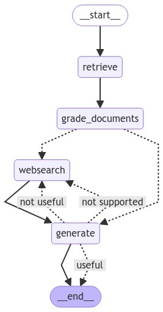

# **Agentic RAG Flows in LangGraph**

This project implements **Agentic RAG** flows in LangGraph, based on the following research papers:

- [**Corrective Retrieval Augmented Generations**](https://arxiv.org/abs/2401.15884)

- [**Self-RAG: Learning to Retrieve, Generate, and Critique through Self-Reflection**](https://arxiv.org/abs/2310.11511)

- [**Adaptive-RAG: Learning to Adapt Retrieval-Augmented Large Language Models through Question Complexity**](https://arxiv.org/abs/2403.14403)

